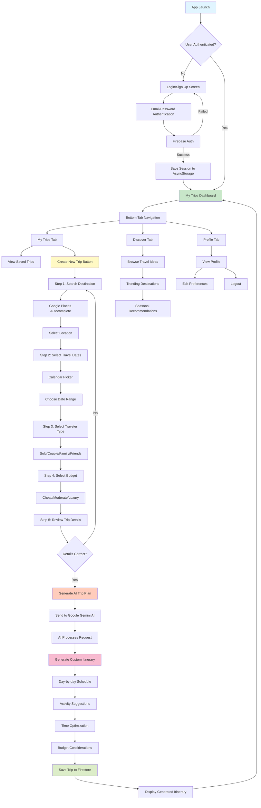

<div align="center">

# 🌍 AI Travel Planner App


### Discover Your Next Adventure Effortlessly

[](https://reactnative.dev/)
[](https://expo.dev/)
[](https://firebase.google.com/)
[](https://ai.google.dev/)
[](https://www.typescriptlang.org/)

**Personalized itineraries at your fingertips. Travel smarter with AI-driven insights.**

[Features](#-features) • [Tech Stack](#-tech-stack) • [Setup](#-getting-started) • [Workflow](#-app-workflow) • [Architecture](#-project-structure)

</div>

---

## 🌟 Overview

**AI Travel Planner** is a cutting-edge mobile application that revolutionizes the way you plan your trips. Powered by Google's Generative AI (Gemini), this app creates personalized travel itineraries based on your preferences, budget, and travel companions. Whether you're a solo traveler, planning a romantic getaway, or organizing a family vacation, our AI-driven platform delivers customized travel plans tailored just for you.

### 🎯 Why AI Travel Planner?

Traditional trip planning is time-consuming and overwhelming. Our app solves this by:
- 🤖 **AI-Powered Automation** - Generate complete itineraries in seconds
- 🎯 **Personalization** - Plans tailored to your exact preferences
- 💰 **Budget-Friendly** - Options for every budget level
- 📱 **Mobile-First** - Plan trips on the go, anytime, anywhere

---

## ✨ Features

<table>
<tr>
<td width="50%">

### 🔐 **Authentication & Security**
- Secure email/password authentication via Firebase
- Persistent login sessions with AsyncStorage
- Protected routes and user data
- Password recovery functionality

### 🗺️ **Smart Trip Planning**
- **AI-Generated Itineraries**
  - Powered by Google Gemini AI
  - Day-by-day activity suggestions
  - Time-optimized schedules
  - Local attractions and hidden gems

- **Intelligent Destination Search**
  - Google Places Autocomplete integration
  - Real-time location suggestions
  - Popular destinations with photos
  - Detailed place information

- **Flexible Date Selection**
  - Interactive calendar picker
  - Multi-day trip support
  - Date range validation
  - Holiday and weekend highlights

</td>
<td width="50%">

### 🎨 **User Experience**
- **My Trips Dashboard**
  - View all saved trips
  - Quick access to itineraries
  - Trip status tracking
  - Easy trip management

- **Trip Discovery**
  - Explore trending destinations
  - Get travel inspiration
  - Browse curated travel ideas
  - Seasonal recommendations

- **Profile Management**
  - Account settings
  - Travel preferences
  - Trip history
  - Logout functionality

### 💰 **Budget Customization**
- **Three Budget Tiers**
  - 💵 Budget-Friendly (Cheap)
  - 💳 Moderate (Medium)
  - 💎 Luxury (High-End)
- Cost estimates for activities
- Budget-appropriate suggestions

</td>
</tr>
</table>

### 👥 **Traveler Types**

<table>
<tr>
<td align="center" width="25%">

**🚶 Solo**
Perfect for independent travelers

</td>
<td align="center" width="25%">

**💑 Couple**
Romantic getaways

</td>
<td align="center" width="25%">

**👨‍👩‍👧‍👦 Family**
Family-friendly activities

</td>
<td align="center" width="25%">

**👫 Friends**
Group adventures

</td>
</tr>
</table>

### 📱 **Additional Features**
- 🎨 **Beautiful UI/UX** - Modern, intuitive interface with custom fonts
- 🌓 **Dark Mode** - Automatic theme switching
- ✨ **Lottie Animations** - Smooth, engaging animations
- 📲 **Responsive Design** - Optimized for all screen sizes
- 🔄 **Offline Support** - View saved trips without internet
- 📍 **Location Services** - GPS-based recommendations
- 🔔 **Smart Notifications** - Travel reminders and updates

---

## 🛠️ Tech Stack

### **Mobile Framework**
<p>


</p>

### **Navigation & Routing**
<p>


</p>

### **Backend & Database**
<p>


</p>

### **AI & APIs**
<p>


</p>

### **UI/UX Libraries**
- **Expo Vector Icons** - Comprehensive icon library
- **Lottie React Native** - Beautiful animations
- **React Native Calendar Picker** - Date selection
- **React Native Gesture Handler** - Touch gestures
- **React Native Reanimated** - Performance animations
- **Expo Blur** - Visual blur effects
- **Expo Image** - Optimized image loading

### **Utilities**
- **Moment.js** & **date-fns** - Date manipulation and formatting
- **dotenv** - Environment variable management
- **Metro Bundler** - Fast JavaScript bundling

---

## 🔄 App Workflow



### Detailed Workflow Description

#### **1. Authentication Flow**
- App checks AsyncStorage for existing session
- If no session found, redirect to login screen
- User enters credentials or signs up
- Firebase validates authentication
- Session token saved locally for persistence
- User redirected to dashboard

#### **2. Trip Creation Flow (5 Steps)**

**Step 1: Destination Search**
- User clicks "Create New Trip"
- Google Places Autocomplete activated
- User types destination name
- Real-time location suggestions appear
- Select destination with details

**Step 2: Date Selection**
- Interactive calendar opens
- User selects start and end dates
- Date range validated (min 1 day)
- Trip duration calculated

**Step 3: Traveler Type**
- Four options presented with icons
- Solo, Couple, Family, or Friends
- Selection affects AI recommendations
- Different activity types suggested

**Step 4: Budget Selection**
- Three budget tiers available
- Budget: Cost-effective options
- Moderate: Balanced experience
- Luxury: Premium experiences
- Price estimates shown

**Step 5: Review & Generate**
- Summary of all selections displayed
- Edit option for each parameter
- User confirms details
- Trigger AI generation

#### **3. AI Generation Process**
- Data sent to Google Gemini AI API
- AI analyzes all input parameters
- Generates personalized itinerary:
  - Day-by-day schedule
  - Morning, afternoon, evening activities
  - Restaurant recommendations
  - Time estimates for each activity
  - Budget-appropriate suggestions
  - Travel tips and local insights
- Response saved to Firestore
- User can view and manage trip

#### **4. Trip Management**
- All trips stored in Firestore database
- Linked to user's Firebase Auth ID
- Accessible from My Trips tab
- Edit, delete, or duplicate trips
- Offline viewing with AsyncStorage cache

---

## 📁 Project Structure

```
my-app/
├── 📱 app/                          # Application screens and routes
│   ├── (tabs)/                      # Bottom tab navigation screens
│   │   ├── discover.jsx             # Discover travel ideas and inspiration
│   │   ├── mytrip.jsx               # My trips dashboard and management
│   │   ├── profile.jsx              # User profile and settings
│   │   └── _layout.jsx              # Tab navigation configuration
│   │
│   ├── 🔐 auth/                     # Authentication screens
│   │   ├── sign-in/                 # Sign in with email/password
│   │   │   └── index.jsx
│   │   └── sign-up/                 # User registration screen
│   │       └── index.jsx
│   │
│   ├── ✈️ create-trip/              # Multi-step trip creation flow
│   │   ├── search-place.jsx         # Step 1: Google Places search
│   │   ├── select-dates.jsx         # Step 2: Calendar date picker
│   │   ├── select-traveller.jsx     # Step 3: Traveler type selection
│   │   ├── select-budget.jsx        # Step 4: Budget tier selection
│   │   ├── review-trip.jsx          # Step 5: Review all details
│   │   ├── generate-trip.jsx        # AI generation and loading
│   │   └── constant/                # Trip options and configurations
│   │       └── Options.js
│   │
│   ├── _layout.jsx                  # Root layout with navigation
│   └── index.tsx                    # App entry point and splash
│
├── 🎨 components/                   # Reusable UI components
│   ├── CreateTrip/                  # Trip creation components
│   │   ├── PlaceSearch.jsx
│   │   ├── DatePicker.jsx
│   │   └── OptionCard.jsx
│   ├── MyTrips/                     # Trip display components
│   │   ├── TripCard.jsx
│   │   ├── TripDetails.jsx
│   │   └── ItineraryView.jsx
│   └── Login.jsx                    # Login form component
│
├── ⚙️ configs/                      # Configuration files
│   ├── firebaseConfig.js            # Firebase initialization
│   ├── AiModal.js                   # Google Gemini AI setup
│   └── test-ai.js                   # AI API testing utilities
│
├── 🌐 context/                      # React Context providers
│   └── CreateTripContext.jsx        # Trip creation state management
│
├── 🎭 assets/                       # Static assets and resources
│   ├── images/                      # Images, logos, and icons
│   │   ├── login.png
│   │   ├── logo.png
│   │   └── placeholder.jpg
│   ├── fonts/                       # Custom font files
│   │   ├── Outfit-Regular.ttf
│   │   ├── Outfit-Medium.ttf
│   │   ├── Outfit-Bold.ttf
│   │   └── ...
│   └── lottie/                      # Lottie animation files
│       ├── loading.json
│       └── success.json
│
├── 🔧 firebase-upload/              # Firebase utilities
│   └── uploadData.js                # Data upload scripts
│
├── 📄 Configuration Files
│   ├── package.json                 # Dependencies and scripts
│   ├── tsconfig.json                # TypeScript configuration
│   ├── app.json                     # Expo app configuration
│   ├── metro.config.cjs             # Metro bundler settings
│   ├── eslint.config.js             # ESLint rules
│   ├── .env                         # Environment variables
│   └── .gitignore                   # Git ignore rules
│
└── 📖 README.md                     # Project documentation
```

### Key Directories Explained

- **`app/`** - Contains all screens using Expo Router's file-based routing
- **`components/`** - Reusable UI components following atomic design
- **`configs/`** - API configurations and service initializations
- **`context/`** - Global state management using React Context
- **`assets/`** - Static files including images, fonts, and animations

---

## 🚀 Getting Started

### 📋 Prerequisites

Before you begin, ensure you have the following installed:

<table>
<tr>
<td width="50%">

**Required Software:**
-  **Node.js v18+**
-  **npm** or **yarn**
-  **Expo CLI**

</td>
<td width="50%">

**Development Tools:**
- **iOS**: Xcode (Mac only) or iOS Simulator
- **Android**: Android Studio + Emulator
- **Mobile**: Expo Go app for testing
- **Git**: Version control

</td>
</tr>
</table>

---

### ⚙️ Installation Steps

#### 1️⃣ **Install Expo CLI Globally**
```bash
npm install -g expo-cli
```

#### 2️⃣ **Clone the Repository**
```bash
git clone https://github.com/mayur2410-tech/Ai-Travel-Planner-App.git
cd Ai-Travel-Planner-App/my-app
```

#### 3️⃣ **Install Dependencies**
```bash
npm install
```

#### 4️⃣ **Set Up Environment Variables**
Create a `.env` file in the root directory (see [Environment Setup](#-environment-setup) below)

#### 5️⃣ **Start Development Server**
```bash
npm start
```

#### 6️⃣ **Run on Your Preferred Platform**
- Press **`a`** for Android emulator
- Press **`i`** for iOS simulator (Mac only)
- Press **`w`** for web browser
- Scan QR code with **Expo Go** app on your mobile device

---

## 🔐 Environment Setup

Create a `.env` file in the `my-app/` directory with the following configuration:

```env
# Firebase Configuration
firebase_api=your_firebase_api_key_here

# Google AI (Gemini) Configuration
GOOGLE_AI_API_KEY=your_google_gemini_api_key_here

# Google Places API
GOOGLE_PLACES_API_KEY=your_google_places_api_key_here

# Optional: Firebase Config (if not in firebaseConfig.js)
FIREBASE_AUTH_DOMAIN=your_project.firebaseapp.com
FIREBASE_PROJECT_ID=your_project_id
FIREBASE_STORAGE_BUCKET=your_project.appspot.com
FIREBASE_MESSAGING_SENDER_ID=your_sender_id
FIREBASE_APP_ID=your_app_id
```

### 🔑 Getting API Keys

<details>
<summary><b>1. Firebase Setup</b></summary>

1. Go to [Firebase Console](https://console.firebase.google.com/)
2. Create a new project or select existing one
3. Click **"Add app"** and select **Web**
4. Copy the configuration values
5. **Enable Services:**
   - Authentication → Email/Password
   - Firestore Database → Create database
   - Storage (optional)
6. Set up security rules for Firestore:
```javascript
rules_version = '2';
service cloud.firestore {
  match /databases/{database}/documents {
    match /UserTrips/{document} {
      allow read, write: if request.auth != null;
    }
  }
}
```
</details>

<details>
<summary><b>2. Google Gemini AI API</b></summary>

1. Visit [Google AI Studio](https://makersuite.google.com/app/apikey)
2. Sign in with your Google account
3. Click **"Create API Key"**
4. Select or create a Google Cloud project
5. Copy the generated API key
6. **Note:** Free tier includes generous usage limits

**Gemini Model Used:** `gemini-1.5-flash`
</details>

<details>
<summary><b>3. Google Places API</b></summary>

1. Go to [Google Cloud Console](https://console.cloud.google.com/)
2. Create a new project or select existing
3. Enable **Places API**:
   - APIs & Services → Library
   - Search "Places API"
   - Click "Enable"
4. Create credentials:
   - APIs & Services → Credentials
   - Create Credentials → API Key
5. Restrict API key (recommended):
   - Set application restrictions
   - Restrict API key to Places API only
6. Copy the API key

**Required APIs:**
- Places API
- Places API (New) - optional for enhanced features
</details>

---

## 📜 Available Scripts

In the project directory, you can run:

### Development Commands

```bash
# Start Expo development server
npm start

# Run on Android emulator
npm run android

# Run on iOS simulator (Mac only)
npm run ios

# Run in web browser
npm run web

# Clear cache and restart
npm start --clear

# Run with tunnel (for physical devices)
npm start --tunnel
```

### Code Quality

```bash
# Run ESLint
npm run lint

# Fix ESLint issues automatically
npm run lint:fix

# Check TypeScript types
npx tsc --noEmit
```

### Project Management

```bash
# Reset project to blank slate
npm run reset-project

# Update dependencies
npm update

# Check for outdated packages
npm outdated
```

---

## 📦 Building for Production

### **Android Build (APK/AAB)**

#### 1️⃣ **Install EAS CLI**
```bash
npm install -g eas-cli
```

#### 2️⃣ **Login to Expo**
```bash
eas login
```

#### 3️⃣ **Configure EAS Build**
```bash
eas build:configure
```

#### 4️⃣ **Build APK (for testing)**
```bash
eas build --platform android --profile preview
```

#### 5️⃣ **Build AAB (for Google Play Store)**
```bash
eas build --platform android --profile production
```

#### 6️⃣ **Download and Install**
- Download APK from Expo dashboard
- Install on Android device
- Or upload AAB to Google Play Console

---

### **iOS Build (IPA)**

#### 1️⃣ **Requirements**
- Apple Developer Account ($99/year)
- Mac computer with Xcode

#### 2️⃣ **Build for iOS**
```bash
eas build --platform ios --profile production
```

#### 3️⃣ **Submit to App Store**
```bash
eas submit --platform ios
```

#### 4️⃣ **TestFlight Distribution**
- Build uploads to App Store Connect
- Add testers in TestFlight
- Distribute beta version

---

### **Expo Go Publishing (Development)**

```bash
# Publish update to Expo servers
expo publish

# Share via QR code or link
# Users scan with Expo Go app
```

---

## 🎯 Key Features Implementation

### 🤖 AI Trip Generation

**How It Works:**
1. User provides trip parameters (destination, dates, budget, travelers)
2. Data formatted as structured prompt for Gemini AI
3. API request sent to Google Generative AI
4. AI processes request considering:
   - Local attractions and landmarks
   - Seasonal weather and events
   - Budget constraints
   - Traveler type preferences
   - Optimal time management
5. AI returns JSON-formatted itinerary
6. App parses and displays day-by-day schedule
7. Trip saved to Firestore for future access

**AI Prompt Structure:**
```javascript
Generate a travel plan for location: {destination}
for {days} days and {nights} nights
for {travelerType} with a {budget} budget.

Provide:
- Day-by-day itinerary
- Time slots for activities
- Place details with geo-coordinates
- Ticket pricing and best times to visit
- Hotel suggestions for each day
- Restaurant recommendations
- Travel tips and local insights

Format: JSON
```

---

### 🔥 Firebase Integration

**Authentication:**
- Email/password sign-up and login
- Persistent sessions with AsyncStorage
- Secure token management
- Password reset functionality
- Protected routes

**Firestore Database:**
```javascript
Collection: UserTrips
Document Structure:
{
  userId: string,
  tripData: {
    destination: object,
    startDate: string,
    endDate: string,
    travelerCount: object,
    budget: string,
  },
  tripPlan: {
    hotels: array,
    itinerary: array,
  },
  createdAt: timestamp
}
```

---

### 🗺️ Google Places Integration

**Features Used:**
- Autocomplete for destination search
- Place details (name, photos, location)
- Geocoding for coordinates
- Place photos and ratings

**Implementation:**
```javascript
// Autocomplete API
https://maps.googleapis.com/maps/api/place/autocomplete/json
?input={userInput}
&key={API_KEY}

// Place Details API
https://maps.googleapis.com/maps/api/place/details/json
?place_id={placeId}
&key={API_KEY}
```

---

### 📱 Navigation Architecture

**File-Based Routing (Expo Router):**
- `/` → Landing/Index screen
- `/auth/sign-in` → Login screen
- `/auth/sign-up` → Registration screen
- `/(tabs)/mytrip` → My Trips dashboard
- `/(tabs)/discover` → Discover screen
- `/(tabs)/profile` → User profile
- `/create-trip/*` → Trip creation flow

**Bottom Tab Navigation:**
- Home icon → My Trips
- Compass icon → Discover
- User icon → Profile

---

## 🐛 Troubleshooting

<details>
<summary><b>❌ Expo CLI Not Found</b></summary>

**Solution:**
```bash
# Install Expo CLI globally
npm install -g expo-cli

# Or use npx
npx expo start
```
</details>

<details>
<summary><b>❌ Firebase Authentication Error</b></summary>

**Solution:**
- Verify Firebase config in `configs/firebaseConfig.js`
- Ensure Authentication is enabled in Firebase Console
- Check API key restrictions in Google Cloud
- Clear app cache: `npm start --clear`
</details>

<details>
<summary><b>❌ Google Places API Not Working</b></summary>

**Solution:**
- Verify API key is correct in `.env`
- Enable Places API in Google Cloud Console
- Check API key restrictions
- Ensure billing is enabled (required for Places API)
- Restart Expo server after `.env` changes
</details>

<details>
<summary><b>❌ AI Generation Fails or Times Out</b></summary>

**Solution:**
- Check `GOOGLE_AI_API_KEY` in `.env`
- Verify internet connection
- API has rate limits - wait and retry
- Check Gemini API quota in Google AI Studio
- Review backend logs for detailed error messages
</details>

<details>
<summary><b>❌ iOS Simulator Not Opening</b></summary>

**Solution:**
```bash
# Mac only - ensure Xcode is installed
xcode-select --install

# Open simulator manually
open -a Simulator

# Then run
npm run ios
```
</details>

<details>
<summary><b>❌ Android Emulator Connection Issues</b></summary>

**Solution:**
- Ensure Android Studio is installed
- Start emulator before running app
- Check ADB connection:
```bash
adb devices
```
- Restart Expo server with:
```bash
npm start --clear
```
</details>

<details>
<summary><b>❌ Metro Bundler Error</b></summary>

**Solution:**
```bash
# Clear Metro bundler cache
npm start --clear

# Or manually clear
rm -rf .expo
rm -rf node_modules
npm install
```
</details>

<details>
<summary><b>❌ Firestore Permission Denied</b></summary>

**Solution:**
- Check Firestore security rules
- Ensure user is authenticated
- Verify Firebase Auth token is valid
- Update security rules:
```javascript
allow read, write: if request.auth != null;
```
</details>

---

## 🔒 Security & Best Practices

### **Environment Variables**
- ✅ Never commit `.env` file to version control
- ✅ Add `.env` to `.gitignore`
- ✅ Use different keys for development and production
- ✅ Rotate API keys periodically

### **Firebase Security**
```javascript
// Recommended Firestore Rules
rules_version = '2';
service cloud.firestore {
  match /databases/{database}/documents {
    // Only authenticated users can access their own data
    match /UserTrips/{userId}/{document=**} {
      allow read, write: if request.auth != null 
                        && request.auth.uid == userId;
    }
  }
}
```

### **API Key Protection**
- Use environment variables
- Implement rate limiting
- Add API key restrictions in Google Cloud
- Monitor usage in console dashboards

---

## 📊 Performance Optimization

### **Image Optimization**
- Use Expo Image for automatic optimization
- Lazy load images
- Cache remote images locally
- Compress images before upload

### **Data Management**
- Implement pagination for trip lists
- Cache frequently accessed data
- Use AsyncStorage for offline access
- Minimize Firestore reads

### **App Performance**
- Use React.memo for expensive components
- Implement virtualized lists for long content
- Lazy load screens with React.lazy
- Profile with React DevTools

---

## 🎨 UI/UX Highlights

### **Design Principles**
- 🎯 **User-Centric** - Intuitive navigation and clear CTAs
- 📱 **Mobile-First** - Optimized for touch interfaces
- ✨ **Delightful** - Smooth animations and transitions
- ♿ **Accessible** - WCAG 2.1 compliant design

### **Custom Styling**
- **Outfit Font Family** - Modern, clean typography
- **Consistent Color Palette** - Brand colors throughout
- **Responsive Layouts** - Adapts to all screen sizes
- **Gesture Support** - Swipe, pinch, and tap interactions

---

## 🚧 Roadmap & Future Enhancements

### **Phase 1 (Current)** ✅
- [x] AI-powered trip generation
- [x] Google Places integration
- [x] Firebase authentication
- [x] Trip saving and management
- [x] Multi-step trip creation flow

### **Phase 2 (In Progress)** 🔄
- [ ] Social sharing of trips
- [ ] Collaborative trip planning
- [ ] In-app messaging
- [ ] Trip reviews and ratings
- [ ] Bookmark destinations

### **Phase 3 (Future)** 📅
- [ ] Real-time weather integration
- [ ] Flight and hotel booking APIs
- [ ] AR city guides
- [ ] Offline maps
- [ ] Multi-language support
