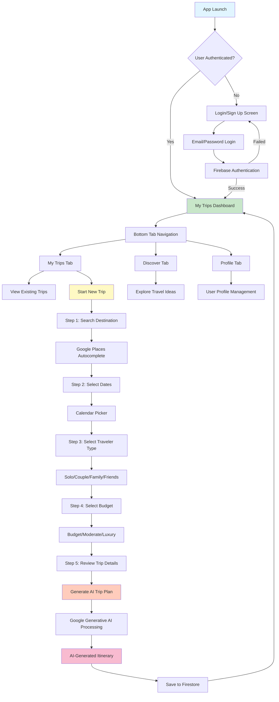

# 🌍 AI Travel Planner App

<div align="center">
  
  
  ### Discover Your Next Adventure Effortlessly
  
  [](https://reactnative.dev/)
  [](https://expo.dev/)
  [](https://firebase.google.com/)
  [](https://ai.google.dev/)
  [](https://www.typescriptlang.org/)
  [](LICENSE)

  **Personalized itineraries at your fingertips. Travel smarter with AI-driven insights.**
</div>

---

## 📋 Table of Contents

- [Overview](#-overview)
- [Features](#-features)
- [Tech Stack](#-tech-stack)
- [App Workflow](#-app-workflow)
- [Project Structure](#-project-structure)
- [Getting Started](#-getting-started)
- [Environment Setup](#-environment-setup)
- [Available Scripts](#-available-scripts)
- [Building for Production](#-building-for-production)
- [Contributing](#-contributing)
- [License](#-license)

---

## 🌟 Overview

**AI Travel Planner** is a cutting-edge mobile application that revolutionizes the way you plan your trips. Powered by Google's Generative AI, this app creates personalized travel itineraries based on your preferences, budget, and travel companions. Whether you're a solo traveler, planning a romantic getaway, or organizing a family vacation, our AI-driven platform delivers customized travel plans tailored just for you.

---

## ✨ Features

### 🔐 Authentication
- **Secure Sign-In/Sign-Up**: Firebase Authentication integration
- **Persistent Sessions**: Auto-login with AsyncStorage
- **Email-based Authentication**: Safe and secure user management

### 🗺️ Smart Trip Planning
- **AI-Powered Itineraries**: Generate complete trip plans using Google Generative AI
- **Destination Search**: Integrated Google Places Autocomplete for location discovery
- **Date Selection**: Calendar picker for flexible trip scheduling
- **Budget Options**: Choose from budget-friendly to luxury travel options
- **Traveler Types**: Customize plans for solo, couple, family, or group trips

### 📱 User Experience
- **My Trips Dashboard**: View and manage all your planned trips
- **Trip Discovery**: Explore travel ideas and inspiration
- **User Profile**: Manage your account and preferences
- **Responsive Design**: Beautiful UI with custom fonts and animations
- **Bottom Tab Navigation**: Intuitive navigation across app sections

### 🎨 Design Features
- **Custom Fonts**: Outfit font family for modern typography
- **Lottie Animations**: Smooth, engaging animations
- **Adaptive Icons**: Platform-specific app icons for iOS and Android
- **Splash Screen**: Branded launch experience
- **Dark Mode Support**: Automatic theme switching

---

## 🛠️ Tech Stack

### **Frontend & Mobile Framework**
<div>
  
  
  
  
</div>

### **Navigation & Routing**
<div>
  
  
</div>

### **Backend & Services**
<div>
  
  
  
</div>

### **AI & Machine Learning**
<div>
  
  
</div>

### **UI/UX Libraries**
- **Expo Vector Icons**: Icon library for UI elements
- **Lottie React Native**: Animation library
- **React Native Calendar Picker**: Date selection component
- **React Native Gesture Handler**: Touch gesture management
- **React Native Reanimated**: Advanced animations
- **Expo Blur**: Visual blur effects
- **Expo Image**: Optimized image handling

### **Utilities**
- **Axios**: HTTP client for API requests
- **Moment.js** & **date-fns**: Date manipulation
- **AsyncStorage**: Local data persistence
- **dotenv**: Environment variable management

---

## 🔄 App Workflow



### Detailed Flow Description

1. **Authentication Flow**
   - App checks for existing user session
   - Redirects to login if not authenticated
   - Firebase handles secure authentication
   - Persistent session using AsyncStorage

2. **Trip Creation Flow**
   - User initiates new trip creation
   - Selects destination using Google Places
   - Chooses travel dates with calendar
   - Specifies traveler type and budget
   - Reviews all inputs before generation
   - AI generates personalized itinerary
   - Trip saved to Firestore database

3. **Trip Management Flow**
   - View all saved trips in dashboard
   - Access detailed trip information
   - Manage and organize travel plans

---

## 📁 Project Structure

```
my-app/
├── app/                          # Application screens and routes
│   ├── (tabs)/                   # Bottom tab navigation screens
│   │   ├── discover.jsx          # Discover travel ideas
│   │   ├── mytrip.jsx            # My trips dashboard
│   │   ├── profile.jsx           # User profile
│   │   └── _layout.jsx           # Tab layout configuration
│   ├── auth/                     # Authentication screens
│   │   ├── sign-in/              # Sign in screen
│   │   └── sign-up/              # Sign up screen
│   ├── create-trip/              # Trip creation flow
│   │   ├── search-place.jsx      # Destination search
│   │   ├── select-dates.jsx      # Date selection
│   │   ├── select-traveller.jsx  # Traveler type selection
│   │   ├── select-budget.jsx     # Budget selection
│   │   ├── review-trip.jsx       # Review before generation
│   │   ├── generate-trip.jsx     # AI trip generation
│   │   └── constant/             # Trip options constants
│   ├── _layout.jsx               # Root layout
│   └── index.tsx                 # App entry point
├── components/                   # Reusable components
│   ├── CreateTrip/               # Trip creation components
│   ├── MyTrips/                  # Trip management components
│   └── Login.jsx                 # Login component
├── configs/                      # Configuration files
│   ├── firebaseConfig.js         # Firebase setup
│   ├── AiModal.js                # AI model configuration
│   └── test-ai.js                # AI testing utilities
├── context/                      # React context providers
├── assets/                       # Static assets
│   ├── images/                   # Images and icons
│   ├── fonts/                    # Custom fonts (Outfit family)
│   └── lottie/                   # Animation files
├── firebase-upload/              # Firebase utilities
├── package.json                  # Dependencies and scripts
├── tsconfig.json                 # TypeScript configuration
├── app.json                      # Expo configuration
├── metro.config.cjs              # Metro bundler config
├── eslint.config.js              # ESLint configuration
└── README.md                     # This file
```

---

## 🚀 Getting Started

### Prerequisites

Before you begin, ensure you have the following installed:

- **Node.js**: v18 or higher ([Download](https://nodejs.org/))
- **npm** or **yarn**: Package manager
- **Expo CLI**: Install globally with `npm install -g expo-cli`
- **iOS Simulator** (Mac only) or **Android Studio** for emulators
- **Expo Go app** on your mobile device (optional, for testing)

### Installation

1. **Clone the repository**
   ```bash
   git clone https://github.com/mayur2410-tech/Ai-Travel-Planner-App.git
   cd Ai-Travel-Planner-App/my-app
   ```

2. **Install dependencies**
   ```bash
   npm install
   ```

3. **Set up environment variables** (see [Environment Setup](#-environment-setup))

4. **Start the development server**
   ```bash
   npm start
   ```

5. **Run on your preferred platform**
   - Press `a` for Android emulator
   - Press `i` for iOS simulator
   - Scan QR code with Expo Go app on your device

---

## 🔐 Environment Setup

Create a `.env` file in the `my-app` directory with the following variables:

```env
# Firebase Configuration
firebase_api=your_firebase_api_key_here

# Google AI Configuration
GOOGLE_AI_API_KEY=your_google_ai_api_key_here

# Google Places API
GOOGLE_PLACES_API_KEY=your_google_places_api_key_here
```

### Getting API Keys

1. **Firebase**
   - Go to [Firebase Console](https://console.firebase.google.com/)
   - Create a new project or use existing
   - Navigate to Project Settings → General
   - Add your app and copy the config values
   - Enable Authentication and Firestore Database

2. **Google AI (Gemini)**
   - Visit [Google AI Studio](https://makersuite.google.com/app/apikey)
   - Create or sign in to your account
   - Generate an API key for Gemini

3. **Google Places API**
   - Go to [Google Cloud Console](https://console.cloud.google.com/)
   - Enable Places API
   - Create credentials (API Key)

---

## 📜 Available Scripts

In the project directory, you can run:

### `npm start`
Starts the Expo development server. Opens the Expo DevTools in your browser.

### `npm run android`
Launches the app on Android emulator or connected device.

### `npm run ios`
Launches the app on iOS simulator (Mac only).

### `npm run web`
Starts the app in web browser mode.

### `npm run lint`
Runs ESLint to check code quality and style issues.

### `npm run reset-project`
Resets the project to a blank slate (moves example code).

---

## 📦 Building for Production

### Android Build

```bash
# Install EAS CLI
npm install -g eas-cli

# Configure EAS
eas build:configure

# Build APK (Android)
eas build --platform android --profile preview

# Build AAB for Play Store
eas build --platform android --profile production
```

### iOS Build

```bash
# Build for iOS
eas build --platform ios --profile production

# Submit to App Store
eas submit --platform ios
```

### Web Deployment

```bash
# Build for web
npm run web

# The static files will be in the web-build directory
# Deploy to your preferred hosting service (Vercel, Netlify, etc.)
```

---

## 🎯 Key Features Implementation

### AI Trip Generation
The app uses Google's Generative AI (Gemini) to create personalized travel itineraries based on:
- Destination details from Google Places
- Travel dates and duration
- Number and type of travelers
- Budget preferences

### Firebase Integration
- **Authentication**: Secure user management with email/password
- **Firestore**: Cloud database for storing user trips
- **Persistence**: React Native AsyncStorage for offline data

### Navigation
- **File-based routing**: Expo Router for intuitive navigation
- **Bottom tabs**: Easy access to main app sections
- **Stack navigation**: For multi-step trip creation flow

---

## 🌐 Deployment

### Live Demo
🔗 **[View Live App](#)** *(Add your deployment link here)*

### Deployment Options

1. **Expo Go** (Development/Testing)
   - Share via QR code
   - Users scan with Expo Go app

2. **TestFlight** (iOS)
   - Build with EAS
   - Upload to App Store Connect
   - Invite testers via TestFlight

3. **Google Play Console** (Android)
   - Build AAB with EAS
   - Upload to Play Console
   - Internal/Alpha/Beta testing

4. **Standalone Apps**
   - Build native binaries
   - Distribute independently

---

## 🤝 Contributing

Contributions are welcome! Please follow these steps:

1. Fork the repository
2. Create your feature branch (`git checkout -b feature/AmazingFeature`)
3. Commit your changes (`git commit -m 'Add some AmazingFeature'`)
4. Push to the branch (`git push origin feature/AmazingFeature`)
5. Open a Pull Request

### Coding Standards
- Follow the existing code style
- Use TypeScript for type safety
- Add comments for complex logic
- Test your changes thoroughly

---

## 📄 License

This project is **private** and proprietary. All rights reserved.

---

## 👨‍💻 Developer

**Mayur Borse**
- GitHub: [@mayur2410-tech](https://github.com/mayur2410-tech)
- Repository: [Ai-Travel-Planner-App](https://github.com/mayur2410-tech/Ai-Travel-Planner-App)

---

## 🙏 Acknowledgments

- [Expo](https://expo.dev/) - Amazing React Native framework
- [Firebase](https://firebase.google.com/) - Backend infrastructure
- [Google AI](https://ai.google.dev/) - Generative AI capabilities
- [React Native](https://reactnative.dev/) - Mobile development framework
- Community contributors and open-source libraries

---

## 📞 Support

For support, email or create an issue in the GitHub repository.

---

<div align="center">
  <p>Made with ❤️ for travelers worldwide</p>
  <p>Happy Traveling! ✈️🌍</p>
</div>
